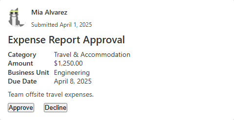
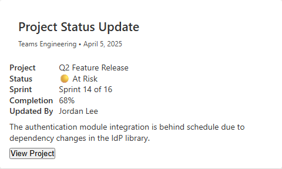
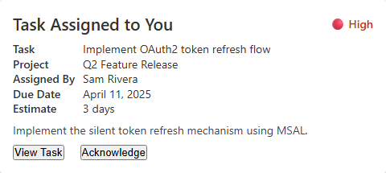
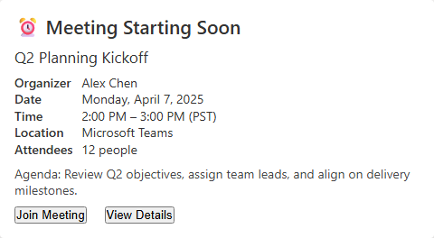
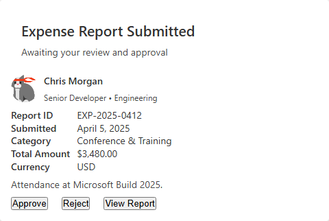

# Teams Adaptive Cards

`TeamsAdaptiveCards` is a static helper class with pre-built card layouts modelled after common Microsoft Teams notification patterns. Each method accepts a strongly-typed input record and returns a fully built `AdaptiveCard`.

## Available Card Types

| Method | Description |
|--------|-------------|
| `CreateApprovalCard` | Approval request with Approve / Decline actions |
| `CreateStatusUpdateCard` | Project status notification |
| `CreateTaskUpdateCard` | Task assignment notification |
| `CreateMeetingReminderCard` | Upcoming meeting reminder with Join link |
| `CreateExpenseReportCard` | Expense report for finance review |

## Approval Card

```csharp
var card = TeamsAdaptiveCards.CreateApprovalCard(new ApprovalCardInput(
    RequesterName:     "Mia Alvarez",
    SubmittedDate:     "Submitted April 1, 2025",
    Title:             "Expense Report Approval",
    Category:          "Travel & Accommodation",
    Amount:            "$1,250.00",
    BusinessUnit:      "Engineering",
    DueDate:           "April 8, 2025",
    Description:       "Team offsite travel expenses.",
    RequesterImageUrl: "https://example.com/avatar.png"));
```



## Status Update Card

```csharp
var card = TeamsAdaptiveCards.CreateStatusUpdateCard(new StatusUpdateCardInput(
    CardTitle:  "Project Status Update",
    TeamName:   "Teams Engineering",
    UpdateDate: "April 5, 2025",
    Project:    "Q2 Feature Release",
    Status:     "🟡 At Risk",
    Sprint:     "Sprint 14 of 16",
    Completion: "68%",
    UpdatedBy:  "Jordan Lee",
    Notes:      "The authentication module integration is behind schedule.",
    ProjectUrl: "https://example.com/projects/q2-release"));
```



## Task Update Card

```csharp
var card = TeamsAdaptiveCards.CreateTaskUpdateCard(new TaskUpdateCardInput(
    TaskName:    "Implement OAuth2 token refresh flow",
    Project:     "Q2 Feature Release",
    AssignedBy:  "Sam Rivera",
    DueDate:     "April 11, 2025",
    Estimate:    "3 days",
    Priority:    "🔴 High",
    Description: "Implement the silent token refresh mechanism.",
    TaskUrl:     "https://example.com/tasks/oauth2-token-refresh"));
```



## Meeting Reminder Card

```csharp
var card = TeamsAdaptiveCards.CreateMeetingReminderCard(new MeetingReminderCardInput(
    MeetingTitle: "Q2 Planning Kickoff",
    Organizer:    "Alex Chen",
    Date:         "Monday, April 7, 2025",
    Time:         "2:00 PM – 3:00 PM (PST)",
    Location:     "Microsoft Teams",
    Attendees:    "12 people",
    Agenda:       "Review Q2 objectives and align on delivery milestones.",
    JoinUrl:      "https://teams.microsoft.com/l/meetup-join/sample",
    DetailsUrl:   "https://example.com/calendar/q2-planning"));
```



## Expense Report Card

```csharp
var card = TeamsAdaptiveCards.CreateExpenseReportCard(new ExpenseReportCardInput(
    EmployeeName:     "Chris Morgan",
    EmployeeJobTitle: "Senior Developer • Engineering",
    ReportId:         "EXP-2025-0412",
    SubmittedDate:    "April 5, 2025",
    Category:         "Conference & Training",
    TotalAmount:      "$3,480.00",
    Currency:         "USD",
    Description:      "Attendance at Microsoft Build 2025.",
    ReportUrl:        "https://example.com/expenses/EXP-2025-0412"));
```


